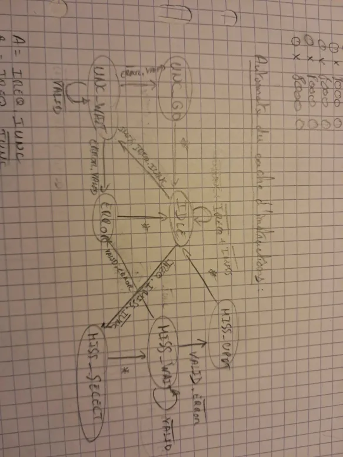
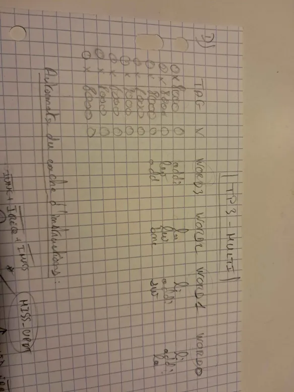
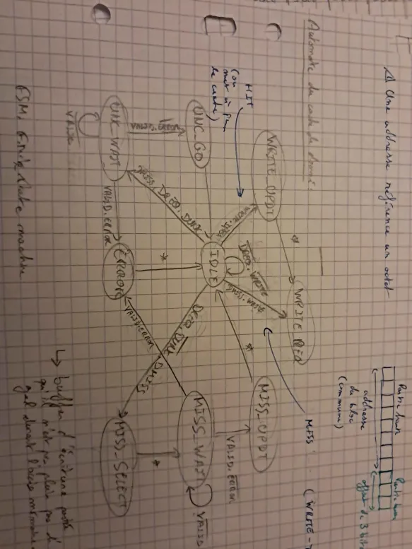
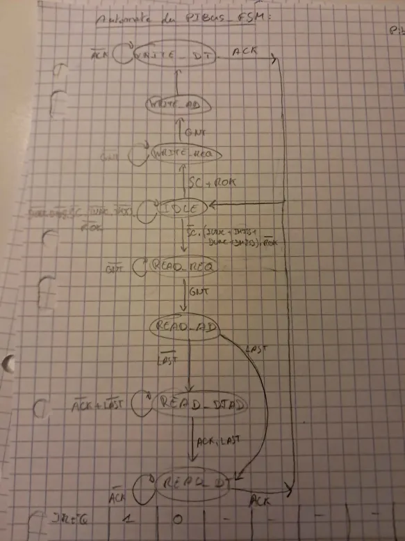
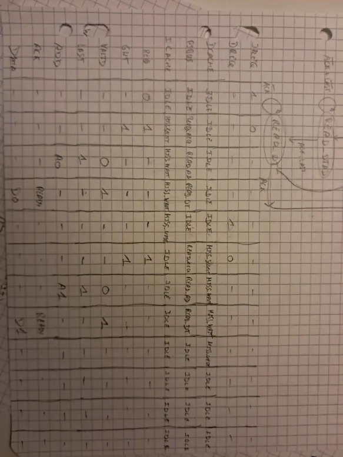

# Compte-rendu TP3

## C - Application logicielle

### C1
(20*2*4 + 48)*2 + 20*2*4 = 576 octets
seg_data_base + 576
Première instruction main -> seg_data_base + 576  = (0x01000000)16 + (576)10
Première instruction loop -> seg_data_base + 4 = (0x01000004)16 + (576)10
<!-- à revoir TODO-->

### C2
A: seg_data_base
B: seg_data_base + 20*2*4+48
C: seg_data_base + (20*2*4+48)*2
<!--a verifier TODO -->

### C3
Pour ne pas gaspiller de cycle, comme lors d'un bne sur l'architecture Mips32 on a un cycle de nop après chaque branchement, on le remplace par une instruction utile.
<!-- A préciser, être sur TODO-->

### C4
<!-- A FAIRE TODO-->
Calculer le nombre de cycle (compter les dépendance etc..)
=> 7 cycles?

## D - Fonctionnement du cache instruction

### D1

BYTE: 4 bits car 16 octets à choisir
SET: 3 bits car 8 lignes à choisir
TAG: 25 bits car 1 seul way possible?
<!-- à revoir TODO -->

0x00400000 correspond donc à:
TAG=0x8000
SET=0x0
BYTE=0x0 

### D2
Les instructions qui ont déclenché un MISS pour atteindre la fin de la première itération de la boucle de la fonction main sont:
lw   $10,    0($8)         # $10 <= A[i]
et
add  $12,    $10,     $11  # $12 <= A[i]+B[i]

### D3
Le cache reste dans le même état et ne fait pas de miss.
<!-- pas sur --TODO-->

### D4
Le MISS_SELECT est indispensable pour les caches qui ne sont pas à correspondance directe. (N_Way > 1)

### D5

A = IREQ.IUNC.IUNC
B = IREQ.IMISS.!IUNC
C = !IREQ + IREQ.IUNC.IMISS
J = !VALID
K = VALID.ERROR
L = VALID.!ERROR
M = *
O = *
I = *
H = !VALID
G = VALID.ERROR
F = VALID.!ERROR
N = *

### D6
Activation de RESETN provoque le passage à l'état IDLE.
L'autre effet doit être d'effacer complètement le cache d'instructions.

## E - Fonctionnement du cache de données

### E1
Le miss a lieu sur:
- la   $8,     A             # $8 <= &A[0]
- lw   $10,    0($8)         # $10 <= A[i]
- lw   $11,    128($8)       # $11 <= B[i]

### E2
20 itérations
2*1/4 Miss pour 1 itération
2*5 = 10 Miss 

<!-- VOIR LE TAG -->

### E3
A = DREQ.DUNC
B = DREQ.!DUNC
C = !DREQ.!WRITE
D = WRITE.WOK
E = 

### E4
La différence est lorsque le tampon d'écritures postées est plein, on boucle sur l'état WRITE_REQ.
Donc tant que le signal WOK est vrai on reste dans WRITE_REQ.
Sinon le reste est comme pour IDLE avec pour chaque condition de transition un et logique avec le signal WOK: WOK.condition.

WRITE_REQ -> WRITE_REQ : WOK.DMISS.WRITE + !WOK
WRITE_REQ -> IDLE : !DREQ.!WRITE!.WOK

## F - Accès au PIBUS

### F1
Les écritures ont la priorité la plus élevée car grâce au tampons d'écritures postées, elles permettent de parallèliser l'écriture en mémoire.
L'inconvénient est que lorsque que le buffer est plein, ce qui peut arriver souvent si l'on a beaucoup d'écritures à la suite, on doit attendre que le buffer se vide donc le temps qu'il soit écrit en mémoire.

### F2
- Les deux automates DCACHE et ICACHE transmettent une requête de lecture au PIBUS_FSM par le signal REQ lorsque le processeur effectue une requête de lecture, et que la donnée est soit absente du cache, soit non-cachable.

- Le serveur (PIBUS) signale au client qui a fait la requête qu'elle a été prise en compte dans le canal Gnt qui indique que le client peut se connecter ou pas au serveur (PIBUS).

- Le pibus signale grâce aux signaux VALID et ERROR que la réponse est disponible et si elle correspond à une erreur.

### F3
Le PIBUS_FSM n'a pas besoin de signaler qu'une écriture du tampon d'écritures postées s'est terminée car elle s'exécute en parallèle. Il signale grâce à WOK que le buffer est plein ou pas. L'utilité de la réponse dans le cas d'une écriture est de savoir si on peut à nouveau écrire dedans (tampon vidé) ou non.

### F4

### F5

Le coût minimal sur le cache d'instruction et de donnée dans le cas d'une lecture qui fait miss est de 6 cycles.

### F6
On a 2 miss lecture toutes les 4 itérations
Sans compter les miss écriture on a donc:
(7 instructions + 10/4 cycles de perdus) * 20 itérations = 190 cycles

On a donc 190 cycles pour exécuter 20 itérations de la boucle.

## G - Expérimentation par simulation

Analyse du fichier trace_1000cycles

cycle 31
premier accès à la ram (miss sur )

### G1
Le processeur exécute sa première instruction au cycle 0 sur l'instruction "la    $29,    seg_stack_base".
Le coût de MISS est de 8 cycles.

### G2
On cherche le miss sur l'adresse de main: 00400000
On identifie au cycle 28 un miss instructions qui correspond à cette adresse.

### G3
Un MISS sur le cache de donnée coûte 8 cycles supplémentaire (cycle 29 -> 36)

cycle 73: début itération 
cycle 108: fin itération

Il termine au cycle 108 la première itération de la boucle.
L'itération prend 35 cycles.

### G4
2ème itération: cycle 109 -> 139 = 31 cycles
3ème itération: cycle 140 -> 170 = 31 cycles

### G5
Durée totale 697 cycles. (dernière occurrence de l'adresse 0x40002c)